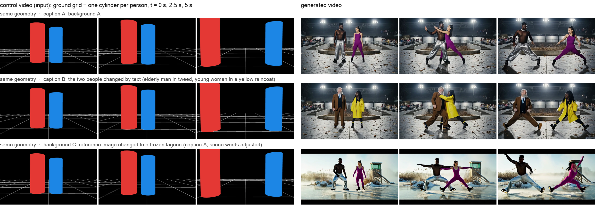
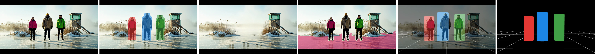
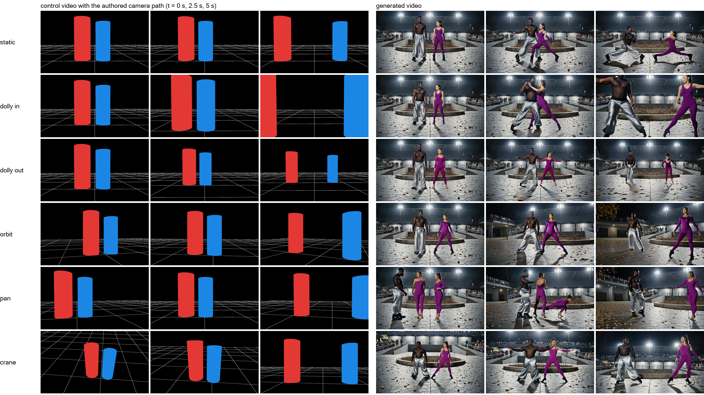

# CoaG: Cylinders on a Grid

**Coarse 3D layout control for video generation.** Draw a ground grid and one cylinder per person, move the cylinders and the camera over 81 frames, and a fine-tuned Wan2.2-Fun-Control model turns the sketch into a photoreal video: the people stand where the cylinders stand, move as the cylinders move, and the camera moves as the drawn camera moves. Appearance comes from the text prompt and a background reference image; layout and motion come from the geometry.



*Left: the control video (three of 81 frames). Right: generated videos. The three rows share the geometry and differ only in the text (row 2) or the background reference image (row 3).*

- Project page with videos: `docs/index.html` (GitHub Pages once the repository is public)
- Paper draft: [`paper/CoaG_draft_2026-09-13.pdf`](paper/CoaG_draft_2026-09-13.pdf)
- Weights, training data: Hugging Face links coming (see [Data](#data) and [Model](#model))

Status: research preview, September 2026. Personal project by Zhangsihao Yang, started 2026-08-31; the preprocessing steps 1-3 were run by Mengyi Shan (UW). <!-- TODO George: confirm author/contributor line before going public -->

## What is in the control signal

- A wireframe **ground grid** in the fitted plane's own frame (origin under the first camera, spacing = median subject height).
- One solid **cylinder per main person**, radius 0.2 x height, height fixed per clip, a fixed 6-colour palette by left-to-right order, painter's ordering, black background.
- 81 frames at 16 fps, rendered through the (possibly moving) camera. Everything a person can author by hand in a minute.

## How the training pairs are made (the data engine)

No real footage and no manual labels. Each of the 2000 clips flows through:

1. **Caption** from a combinatorial seed (50 regions x 162 ground archetypes, 118 action families, 8 camera moves, weather / lighting / crowd flags), expanded and validated by an LLM (`captions/`).
2. **Video** generated with Veo 3.1 Fast, 6 s, 720p, resampled to 81 frames at 16 fps (`videogen/`).
3. **People**: SAM 3.1 video tracking with the prompt "person"; **background**: LaMa inpainting of frame 0; **ground**: an agent loop that proposes a SAM 3 phrase, judges the overlay and retries; **cameras + points + normals**: HunyuanWorld-Mirror on 10 keyframes (specs in `preprocess/PREPROCESS_DESIGN.md`).
4. **Plane + cylinders + control video**: RANSAC plane with normal agreement, GeoCalib horizon cross-check, foot-ray / plane lifting, QC flags, rendering (`preprocess/step4_render.py`, `preprocess/geom.py`).



*Input frame, person masks, LaMa background, ground mask, plane + cylinders, control frame.*

Result: 1935 training tuples (control video, background image, caption, target video) and 40 hold-out clips.

## Model

- Base: [Wan2.2-Fun-A14B-Control](https://huggingface.co/alibaba-pai/Wan2.2-Fun-A14B-Control), `control_ref` mode (control video + reference image + text).
- LoRA rank 64 / alpha 32 on `q, k, v, ffn.0, ffn.2` of both experts (low-noise and high-noise), 480p bucket (token length 640), 81 frames, one epoch per expert.
- Training code: [VideoX-Fun](https://github.com/aigc-apps/VideoX-Fun) at commit `968f0e2` plus a small patch (`train/patched/`, applied by `train/apply_patch.sh`) that lets the dataset read an external reference image (`ref_file_path`, the LaMa background) instead of a frame of the training clip, so training matches inference.
- Weights: `checkpoint-241.safetensors` for each expert (509 MB each). <!-- TODO: Hugging Face model repo link -->

Measured on 8 x H100 80GB (DeepSpeed ZeRO-2, batch 1 per GPU): 27 s per step, 70 GB per GPU, 241 steps per expert, about 1 h 50 min per expert. See `train/RUNLOG.md` for the full log and `train/TRAIN_DESIGN.md` for the design.

## Author your own scene (the editor)

`editor/index.html` is a single-file web editor: place 1–6 people on the ground grid from a top view, drag them to keyframes at frames 0/20/40/60/80, set each person's height, pick a camera path (static, dolly in / out, orbit, pan, crane) with height, pitch, yaw and focal length, and watch the live perspective preview. Export `scene.json`, then

```
.venv/bin/python editor/render_authored.py scene.json out/my_scene
```

renders `control.mp4` with the same code path as the training data (`preprocess/rerender_camera.py`, `preprocess/geom.py`, the step-4 palette), so authored videos sit inside the training distribution. Feed `control.mp4`, a background image and a prompt to `train/run_infer_case.sh` (`CV=... REF=... PROMPT=...`). Two examples with rendered outputs are in `editor/examples/`; the format is documented in `editor/scene_schema.md`.

## Results beyond the training distribution

All on hold-out geometry, one fixed seed, no per-case selection (videos on the project page):

- **Hand-authored scenes** from the editor, including two Roman soldiers duelling in the Colosseum under four camera paths with a photograph as the background (Colosseum Interior 1 by daryl_mitchell, CC BY-SA 2.0, via Wikimedia Commons; cropped, tourists patched out).
- **Unseen scenes**: the background reference image of one hold-out clip with the geometry of another (cathedral nave, Moscow ballroom, foggy Tokyo promenade, olive grove).
- **Unseen actions**: prompts outside the 118 training action families (tai chi, juggling, walking and chatting, carrying a ladder).
- Known failure cases: a spurious extra person under a pan, weak dolly-out, prompt-induced extra objects, and people rendered larger than the cylinders when the background photograph's viewpoint is far from the training cameras.

## Camera control



Six authored camera paths on the same cylinders, caption and reference image. Dolly in, orbit, pan and crane are followed; dolly out only weakly; the pan clip shows a spurious third person in its first frames (a known failure case).

## Repository layout

```
editor/       hand-authoring: index.html (top view + camera presets -> scene.json), render_authored.py (-> control.mp4 via the step-4 renderer)
captions/     seed sampler + LLM writer/validator; captions/out/captions.jsonl = the 2000 captions
videogen/     Veo 3.1 Fast batch generation on fal.ai (resumable, sidecar json per clip)
preprocess/   PREPROCESS_DESIGN.md (steps 1-4), geom.py (RANSAC plane, horizon), step4_render.py (cylinders + control video),
              rerender_camera.py (authored camera paths), make_train_manifest.py, geocalib_horizon.py, QC summaries
train/        setup_pod.sh, apply_patch.sh + patched/, train_gate3.sh, train_full.sh, run_infer_case.sh, run_compare.sh,
              snapshot_env.sh, fetch_from_pod.sh, TRAIN_DESIGN.md, RUNLOG.md
paper/        the paper draft (PDF)
docs/         project page and its assets (sample videos, figures)
```

## Reproduce

1. **Captions**: `python -m captions.capgen --help` (needs an LLM backend; see `captions/README.md`).
2. **Videos**: `python videogen/gen_videos.py --key-file <fal key file> --all` (about $0.60 per clip at the time of writing).
3. **Preprocessing steps 1-3** (SAM 3.1, LaMa, HunyuanWorld-Mirror, agentic ground mask): follow `preprocess/PREPROCESS_DESIGN.md`; one folder per clip.
4. **Step 4**: `preprocess/run_step4_full.sh <preproc_dir> <out_dir>` then `preprocess/make_train_manifest.py` and `train/build_videox_dataset.py`.
5. **Training** on a rented box: `train/bootstrap_pod.sh` (copies scripts, installs, downloads weights and data) then `WORK=/workspace EPOCHS=1 TOKEN=640 train/train_full.sh both`.
6. **Inference**: `CID=<clip> CAM=<orig|static|dolly_in|dolly_out|orbit|pan|crane> LORA_LOW=... LORA_HIGH=... train/run_infer_case.sh`, or `train/run_compare.sh` for the comparison set.

## Data

- 2000 captions with their seed cards: `captions/out/captions.jsonl`, `captions/out/seeds.jsonl`.
- Control videos, background images, cameras and the 81-frame clips: Hugging Face dataset, link coming. <!-- TODO: public HF dataset -->

## Citation

```bibtex
@misc{yang2026coag,
  title  = {CoaG: Cylinders on a Grid --- Coarse 3D Layout Control for Video Generation},
  author = {Yang, Zhangsihao},
  year   = {2026},
  note   = {Preprint}
}
```

## Acknowledgements

Wan2.2 and VideoX-Fun (Alibaba PAI), SAM 3 (Meta), LaMa, HunyuanWorld-Mirror (Tencent), GeoCalib, Veo 3.1 (Google DeepMind, via fal.ai). Compute: RunPod.

## License

TBD. <!-- TODO George: code license (MIT / Apache-2.0); weights follow the Wan2.2 license; data terms follow the Veo terms -->
