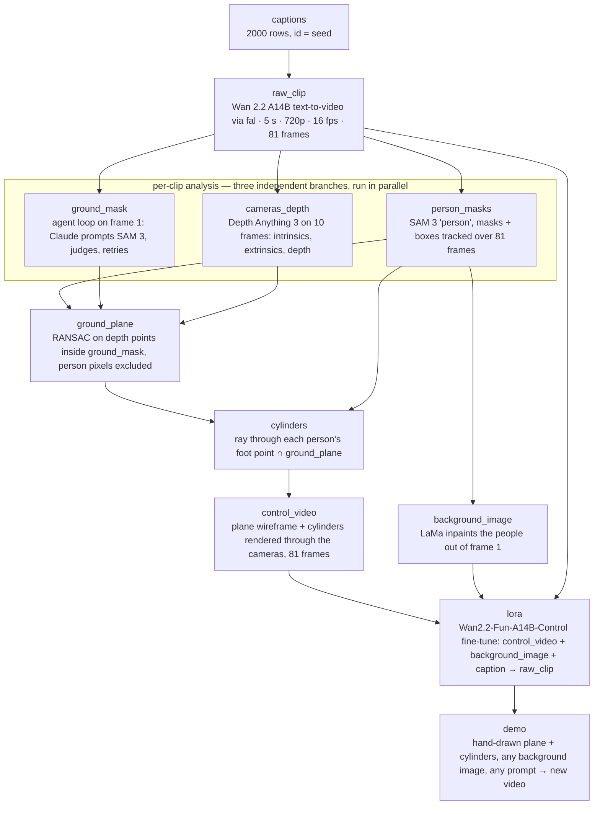

# Caption Generation Design — for review (2026-09-05)

> Review protocol: add inline comments starting with `>>>>`.
> Section 7 lists every open decision with options and a recommendation; mark your choice next to each.
> Nothing gets generated or paid for until this document is approved.

## 0. What this system does, in one paragraph

Input: the axis vocabularies (50 regions, 169 ground archetypes, weather, environment motion, vibe, motion range, action family, camera, person count) and one integer seed.
Output: `captions.jsonl`, 2000 rows, each a finished caption plus all of its metadata, ready to be sent to the video model with the row id as the generation seed.
In between, four steps.
Sample (code only): deal every caption a recipe card from balanced decks — one region, one ground archetype, one weather, one motion range, one action family, one camera, a person count, and the crowd and close-approach flags — with exact shares and no repeated place.
Tag and pre-check (Claude): once, label every archetype and action family with the attributes the dealer needs (indoor, size, audience natural, ice, supported ranges); then read the 2000 recipe cards and throw back the ones that cannot be made to work.
Write (Claude): turn each card into one caption, inventing the concrete place and the concrete action, and return a short scene summary and action summary alongside.
Check and repair (Claude + code): a second reader grades every caption against the rules; code compares all 2000 scene and action summaries for near-duplicates; failures are rewritten with the reason attached.
Then 20 samples go to George for approval before any video is generated.

## 1. Where captions sit and what they must buy us

Captions are the first stage of the pipeline below.
Each later stage is named after the artifact it produces; those names will also be the folder names in the repo.

The same stages in words, for editors that do not render Mermaid:

1. captions — this document produces 2000 rows; the row id doubles as the generation seed.
2. raw_clip — Wan 2.2 A14B text-to-video via the fal API: 5 s, 720p, 16 fps, 81 frames.
3. person_masks — SAM 3 finds every person and tracks masks and boxes across all 81 frames.
4. ground_mask — on frame 1, Claude proposes a SAM 3 prompt for the flat ground, SAM 3 returns a mask, Claude judges whether it is all ground and neither too little nor too much, and retries up to 3 times.
5. cameras_depth — Depth Anything 3 on 10 evenly sampled frames: camera intrinsics and extrinsics plus consistent depth and 3D points.
6. ground_plane — RANSAC plane fit on the depth points that fall inside ground_mask, with person pixels excluded.
7. cylinders — for each person, the ray through the foot point of their box is intersected with ground_plane; the cylinder stands there.
8. control_video — the plane wireframe and the cylinders rendered through the recovered cameras for 81 frames.
9. background_image — LaMa inpaints the people out of frame 1 using person_masks; this is the reference image the model is conditioned on (confirmed by George).
10. lora — LoRA fine-tune of Wan2.2-Fun-A14B-Control on (control_video, background_image, caption) → raw_clip.
11. demo — a hand-drawn plane and cylinders, any background image, any prompt → new video.

Dependencies: person_masks, ground_mask and cameras_depth need only raw_clip; ground_plane needs all three; cylinders needs person_masks and ground_plane; control_video needs cameras_depth and cylinders; background_image needs person_masks; lora needs control_video, background_image and raw_clip.

Parallelism: the 2000 clips are independent, so every stage after captions shards across N GPUs or API workers.
Inside one clip the three analysis branches have no dependency on each other.
Stages are streaming: preprocessing starts on the first clips while generation is still producing the rest.

What the model has to learn is one mapping: coarse geometry (where the ground is, where the people are, how the camera moves) + a background image + text → photoreal video.
So the caption set must be diverse exactly where the user is free at demo time, and controlled exactly where the control signal is explicit.

Scene appearance — place, materials, light, weather — is what the user changes freely through the prompt and the background image, so it needs maximal diversity: 2000 distinct places.

People are half-controlled: their count, position and motion come from the cylinders, while their look comes from the prompt; so counts must be exact and looks vivid and varied.

Camera motion is explicit in the control video, so it comes from a small fixed set of moves rather than free description.

The ground must be reconstructable as one plane, so it is always flat, visible and named.

The shot must be one continuous take, because the reconstruction assumes a single camera path.

## 2. Hard rules and the downstream reason for each

**R1. The main subjects are counted exactly, with a number word, adults only, no animals.**
Why: the number of cylinders must equal the number of main subjects.
An audience or bystanders are allowed under Decision A; when present they must be visibly off the playing surface (stands, behind railings, far background), so that the cylinder stage can ignore them.

**R2. The main subjects' full bodies are in frame, feet touching the ground, for at least the first second; jumps are fine.**
Why: the cylinder needs one anchored foot point on the plane to get its position and size.
Whether people may then come close to the camera and be partly cut off is Decision B.

**R3. Flat, clearly visible ground with a named material; a small area is fine (a boxing ring); wet, icy, snowy, shallow-water and gently sloped surfaces are fine; never stairs, never a mirror floor.**
Why: the pipeline fits one plane — a slope is still a plane, water is a plane, but stairs are several planes, and a mirror floor reflects the people so SAM 3 counts them twice.

**R4. One continuous take; no montage, cut or transition wording.**
Why: multi-frame reconstruction assumes one camera path.

**R5. The camera move is one of 8 predefined moves (static tripod, pan, orbit, dolly-in, dolly-out, handheld circle, crane down, sideways track).**
Why: the control video renders the same camera path, and a closed set of moves is learnable.

**R6. Motion range is chosen per caption — in place, short range, or long range — and the people move with energy within that range.**
Why: the model should see both a boxer bouncing on one spot and a sprinter crossing the frame; the mix is Decision C.
Nobody leaves the frame during the 5 seconds.

**R7. The environment is either still or in motion (wind, rain, waves, light trails, steam, fireworks), chosen per caption.**
Why: dynamic scenes were a requirement, but static scenes are the cleanest reconstruction case and are realistic too; the mix is Decision D.

**R8. 60–125 words, English, photoreal, present tense.**
Why: Wan 2.2 prefers dense descriptive prompts, and a 40-card smoke test showed the model needs about 100 words to fit count, anchor, ground, camera, environment and flags; the full 2000-caption run then landed at 86–121 words, so the cap is 125; 125 words is still only ~160 text-encoder tokens.

**R9. No minors, celebrities, brands, logos, readable text, real weapons, NSFW, gore.**
Why: safety filters on the generation API, and a clean public dataset.

**R10. Each caption reads differently; no template reuse.**
Why: the model should not learn prompt boilerplate.

## 3. Design principle: seeds guarantee coverage, the model invents the specifics

Asking a model to "write 2000 diverse captions" collapses into cinematic clichés after a couple of hundred, and coverage cannot be proven afterwards.
A pure template (fixed scene list × fixed action list) proves coverage but caps the number of places at the length of the list.
Generating sequentially with a memory of the scenes already written keeps the right idea — compare against what exists — but forces 2000 serial calls with a growing history, and "avoid X" is a weak instruction (a Tokyo rooftop becomes an Osaka rooftop).

The chosen design: every caption receives a seed tuple drawn from a combinatorial grid, so coverage is guaranteed by construction.
The writer must invent a concrete place and a concrete action from the seed; it never copies the seed words.
Validators and mechanical checks enforce the rules; the comparison against existing scenes happens after generation, in parallel, as a similarity check.
Everything is deterministic: caption id `c0000`–`c1999` is also the generation seed, so the dataset is reproducible from this document plus the vocabularies.

## 4. Diversity axes

Region (50, hand-written): continents, climates, city and rural, e.g. Tokyo, Marrakech, the Icelandic coast, Utah salt flats, Rio, the Inner Mongolian steppe, an Antarctic station.
It sets architecture, vegetation, light and clothing.

Ground archetype (162, in `archetypes.json`): the kind of flat surface underfoot, from granite plaza and container-port quay to boxing ring, judo dojo, frozen lake, coffee-drying patio and volcanic ash plain.
Criterion is flat and visible only; size is irrelevant.
Each archetype is tagged whether an audience is natural there (stadiums, arenas, courts, stages, plazas), for Decision A.

Weather and time (12): golden hour, blue hour, harsh noon, overcast, light rain, heavy snow, fog, neon night, floodlit night, misty sunrise, dusty wind, pre-storm sky.

Environment motion (15 = 14 elements + still; two of the elements are indoor-only — haze-machine fog with moving spotlights, and dust stirred by big fans — added so indoor cards have more than three elements to draw from): flags in wind, swirling leaves, rain splashes, snowflakes in light, traffic light trails, crashing waves, steam vents, fireworks, rolling fog, confetti, blowing sand, flickering neon and searchlights, or a still scene; the share of still scenes is Decision D.

Vibe (6): epic cinematic, gritty documentary, playful commercial, neo-noir, sports ad, dreamy music video.

Motion range (3): in place (footprint under about 1 m: boxing, rope skipping, dancing on the spot), short range (1–5 m: sparring, dribbling, a dance phrase, tag in a small area), long range (over 5 m: sprinting across the frame, a chase, long leaps); shares are Decision C.

Action family (118, in `axes.json`): brainstormed by 10 category agents (ball sports, combat, dance, athletics, acrobatics, street games, fitness drills, fast work, props, surface-specific), mechanically deduplicated and curated the same way as the archetypes; George asked for at least 100 after the first run showed 15 was thin next to 169 archetypes. The family is a direction, not a script: the writer is told to produce a sibling move, a variation or a combination in the same spirit, so captions in one family still differ in the specific moves.
Each family is tagged with the motion ranges it supports, whether it needs a hard surface, whether it needs running room, whether it fits a small venue, whether it works only on ice, whether it needs dry ground, and the minimum number of people, so the seed only pairs compatible values (tags live in `axes.json`, reviewable).

Camera (8, fixed on purpose): static tripod, pan left to right, orbit, dolly-in, dolly-out, handheld circle, crane down, sideways track.

Person count (6 buckets): 1×500, 2×450, 3×350, 4×300, 5×200, 6×200 = 2000; Decision E.

Crowd flag: a share of captions (Decision A) in audience-natural archetypes include a crowd off the playing surface.

Close-approach flag: a share of captions (Decision B) let a subject move toward the camera after the anchored first second.

### 4.1 Sampling method — how 2000 combinations are drawn from the axes

Sampling is done by code, not by Claude.
The three things sampling must deliver — exact shares, coverage guarantees, and reproducibility — are exactly what a model cannot promise: asked to pick combinations it drifts toward favorites, shares wander, and two runs differ.
Claude is used for the judgment calls around sampling (tagging, section 4.2) and for everything after it (writing, validating, repairing, section 5).

The method is balanced dealing from shuffled decks, seeded so the whole draw is reproducible from one integer.

Step 1, place.
Shuffle the 50 regions and the 169 archetypes with the seed.
Region r takes 40 consecutive positions in the archetype cycle starting at 40·r, so every region gets exactly 40 captions, every archetype gets 11 or 12, and no (region, archetype) pair repeats because 40 is smaller than 169.

Step 2, tags decide which deck each caption draws from.
Every archetype carries tags produced once by Claude and then corrected by hand where the pre-check proved them wrong: indoor or outdoor, size (small / medium / large; aisles and corridors were re-tagged small), audience natural (yes / no), surface (normal / reflective / ice / shallow water), and low ceiling (underpasses, tunnels, garages, server halls, clubs).
Every action family carries the motion ranges it supports and whether it works on ice.

Step 3, deal the remaining axes from decks whose composition equals the target shares.
A deck is a list with exactly the intended counts, shuffled with the seed, then dealt in order; shares come out exact instead of approximately right.
Where an axis depends on a tag, the deck is built per stratum: outdoor captions draw weather from the 12-value weather deck (fog, heavy snow and night capped to the agreed share), indoor captions draw from a 6-value indoor-lighting deck instead.
Environment motion is dealt with a still share of 40% across both strata, and each element is tagged indoor / outdoor / both so waves never appear in a gym.
Motion range is dealt per size stratum: only large venues receive long-range cards (the second pre-check showed that "medium" corridors, aisles and helipads cannot host a run across the frame); small and medium venues draw from in place and short range in the 3:4 ratio, and large venues absorb the rest so the global 30 / 40 / 30 still holds.
Action family is assigned per card by an eligibility test followed by least-used-first choice: for each card (in seeded random order) the sampler lists every family whose tags allow it, then picks the family that has been used least so far, so counts stay balanced across families without fixed strata.
The eligibility test is where every lesson from the plausibility pre-check lives: supported motion ranges; minimum number of people (double dutch needs three); a hard bouncing surface for basketball, tap and pirouettes, decided from the ground-material words; running room and a per-family "fits a small venue" flag; outdoor-only for throwing events with a landing sector (shot put, discus, javelin, long jump); headroom for tosses and lifts (indoor only in large venues without a low ceiling); required ground words for surface-bound actions (belly-flop dives need sand or snow, splash fights need shallow water, shoveling needs loose material); excluded ground words for tumbling (no gravel, cobbles or rubble); large-venue-only for throwing events and heavy-equipment work; archetype pins for a few families (lay-ups only on basketball courts, curling only on curling sheets, skating never on a curling sheet); and on ice only families tagged ice-only or ice-capable.
Ground-word rules match whole words, not substrings — "sandstone" is not sand (a bug the third pre-check caught).
Person count is a deck of 500 / 450 / 350 / 300 / 200 / 200, dealt so that small venues receive only 1–3 people and the global plan still holds exactly.
Camera and vibe are independent uniform decks.
The crowd flag is dealt only among audience-natural captions, 400 cards (20% of 2000); if fewer than 400 such captions exist the report says so instead of inventing them.
The close-approach flag is dealt among short- and long-range captions, 300 cards (15%).

Step 4, verify and freeze.
The sampler writes `seeds.jsonl` (2000 rows, one per caption) and `seeds_report.md` with every histogram and every constraint check; both are committed, and regenerating with the same seed reproduces them byte for byte.

Alternatives considered: independent weighted random draws per axis are simpler but let shares drift by a few points and give no uniqueness guarantee without rejection loops; letting Claude choose the combinations is rejected for the reasons above.

### 4.2 What Claude does around sampling

Tagging, once: Claude reads the 169 archetypes and the 14 action families and emits the tags in section 4.1 as JSON; George reviews the file before it is used.
Plausibility pre-check, optional: Claude reads the 2000 sampled seed rows in batches and flags combinations that cannot be made to work even with adaptation (e.g. a fencing bout on a frozen lake at long range); flagged rows are re-dealt from the same decks.
This costs a few dollars and removes the strangest seeds before any writing happens; whether to run it is Decision P.

### 4.3 How repeated scenes and repeated actions are prevented

Three layers, from cheapest to last resort.

Layer 1, by construction.
No two captions share a (region, archetype) pair, so no two captions describe the same kind of place in the same part of the world; that is a guarantee of the dealer, not a hope.
For actions, the card already fixes action family × motion range × person count × venue size, which spreads the 2000 captions over hundreds of distinct cells before any writing happens.

Layer 2, in the prompt.
The writer sees the 40 cards of its batch together and is told that every place and every action in the batch must be clearly different from each other; it must invent specifics (2–3 visual details of the place, the concrete move, props, formation), never restate the card.
Each caption returns a `scene` summary and an `action` summary as separate fields so the next layer can compare them mechanically.

Layer 3, global check in code, across all 2000, not just within a batch.
Every `scene` summary is compared with every other by word-set similarity (Jaccard); above 0.6 the later one is rejected.
Within the same action family, the full caption texts are compared the same way; above 0.45 the later one is rejected.
(The first full run showed that comparing the short action summaries instead produces hundreds of false positives — "two acrobats flip and handspring on one spot" recurs by construction while the captions themselves share only 10–25% of their words — so the action check runs on captions.)
Rejected rows go to repair with the twin shown in the prompt: "your scene is too close to c0412 — <its scene>; write a clearly different place."
Repair rows are checked again; the loop stops when nothing new is rejected or after three rounds, and anything still colliding is reported, not hidden.

What this does not do: it does not stop two captions from sharing a phrase or a mood, and it should not — a "cracked concrete floor" may legitimately appear in Lagos and in Chicago.
It stops the dataset from containing the same place or the same move twice.

## 5. Generation procedure — a Python script over the Claude API

Everything below lives in the repo as a small Python package (`captions/`) using the official `anthropic` SDK, so the dataset is reproducible from code plus one seed and does not depend on an interactive session.
Model: `claude-opus-5` with adaptive thinking on either backend.
Two interchangeable backends behind one flag.
`--backend claude-code`: the script shells out to the local Claude Code CLI in print mode (`claude -p --json-schema ... --output-format json`), which bills George's Claude Max subscription at no marginal cost; structured output is supported; the 5-hour usage windows apply, so the 2000-caption run may have to be resumed across windows (the script is resumable per batch).
`--backend api`: the official `anthropic` Python SDK against the Message Batches endpoint, asynchronous at half price, no usage windows; rough cost for the whole run including validation and repair under $50.
Default is `claude-code`; switch to `api` if the usage window becomes the bottleneck.

1. `sampler.py` produces `seeds.jsonl` and `seeds_report.md` (section 4.1); no API calls.
2. `tag.py` runs once to produce `tags.json` from the archetype and action-family lists (section 4.2); reviewed by George before the sampler uses it.
3. `write.py` sends the seeds in batches of 40 per request; the prompt carries the rules and the instruction that the seed is not a template — invent one concrete place with 2–3 distinctive visual details and one concrete action.
   Output per caption, enforced with a JSON schema: `scene` (≤20 words), `action` (≤12 words), `caption`.
4. `validate.py` sends each batch of (seed, output) pairs to a fresh request that re-reads all rules and returns per-caption verdicts: `ok`, `fixed` with the corrected text, or `reject` with the reason; it also flags near-identical scenes or phrasing inside the batch.
5. Mechanical checks in code: word count 60–125; action summary must not merely restate the family name (word-set similarity ≥ 0.7 after removing count words is rejected, so "krump with stomps, chest pops and arm swings" has to become a specific variation); forbidden-word scan; exact-duplicate captions by normalized token set; near-duplicate scenes by Jaccard similarity of the `scene` word sets above 0.6, the later one rejected.
6. `repair.py` rewrites every rejected or duplicate seed with the failure reason in the prompt; the final assembly reports any still-missing ids instead of silently filling them.
7. `review.py` samples 20 captions every 100 ids with a one-line Chinese summary and prints the coverage statistics; George approves before any video-generation spend.

## 6. Acceptance criteria before spending on generation

- 2000/2000 ids present; the person-count histogram equals the plan exactly.
- 2000 distinct (region, archetype) pairs; scene near-duplicate rate after repair under 1%.
- Zero forbidden-word hits on manual inspection of flagged lines; 100% contain a continuous-shot phrase.
- Motion-range, still-environment, crowd and close-approach shares within ±3 points of the chosen plan.
- 20-sample review: George rejects at most 2 of 20; otherwise the rule that caused it is fixed and only the affected batches rerun.

## 7. Decisions

Status 2026-09-08: final dataset produced with 118 action families × 162 archetypes — 2000/2000 accepted, 0 unresolved, all acceptance checks in section 6 green; see `out/review.md`.
Status 2026-09-06: George gave the go-ahead before answering the items individually, so the run used every recommendation below (S1, X1 claude-code, M1 opus, N1, A2, B3, C1, D1, E1, F keep, G 25% cap, H keep, I 2000×1, J holdout 40, K keep, L keep). Overriding any of them means re-dealing and re-running; the code makes that a one-command job.

Decision S — sampling method.
Option S1: balanced dealing from seeded, shuffled decks with per-tag strata (section 4.1); exact shares, guaranteed coverage, reproducible.
Option S2: independent weighted random draws per axis with a seed; simpler code, shares drift a few points, uniqueness needs a rejection loop.
Option S3: Claude picks the combinations; rejected — not reproducible, drifts to favorites, costs more.
Recommendation: S1.

Decision P — Claude plausibility pre-check on the 2000 seed rows before writing.
Resolved: yes, run it (George, 2026-09-06).

Decision X — which Claude to call.
Option X1: local Claude Code in print mode, on the Max subscription; $0 marginal, usage windows apply, resumable.
Option X2: Anthropic API with the Batches endpoint; under $50, no windows.
Recommendation: X1 as default with X2 behind a flag, so a window limit never blocks the run.

Decision M — model and effort for the writing and validation calls.
Option M1: `claude-opus-5` for every stage, effort medium for writing, high for validation; batch endpoint; under $50 total.
Option M2: `claude-opus-5` for validation and repair, `claude-sonnet-5` for writing; roughly halves the writing cost, slightly plainer prose.
Recommendation: M1; the cost difference is not worth a quality step-down on the dataset itself.

Decision N — stage names.
Option N1 (used above): name each stage by the artifact it produces — person_masks, ground_mask, cameras_depth, ground_plane, cylinders, control_video, background_image, lora, demo; the same words become repo folders and manifest columns.
Option N2: verb phrases — detect people, find ground, reconstruct 3D, fit plane, place cylinders, render control, erase people, train LoRA, demo; reads well in prose, worse as file names.
Option N3: numbered stages S1–S9 with short names; numbers suggest an order that the parallel branches do not have.
Recommendation: N1.

Decision A — audience and bystanders (your Olympic bike-race example).
Option A1: none anywhere; simplest, but excludes arenas and stadiums as they really look.
Option A2: allowed in archetypes where an audience is natural, always off the playing surface (stands, bleachers, behind railings, far background), in up to 20% of captions; the cylinder stage keeps only people whose foot point lands on the fitted plane and whose mask is at least 10% of the frame height, so the crowd is ignored; the check becomes "cylinders = main subjects" instead of "SAM count = caption count".
Option A3: allow crowds anywhere including on the plane, and give every detected person a cylinder; consistent, but far people give tiny noisy cylinders and the caption count stops meaning anything.
Recommendation: A2 at 20%.

Decision B — subjects moving close to the camera.
Option B1: full bodies in frame throughout; simplest, loses the walk-toward-camera shots that look best in a demo.
Option B2: allowed freely; the cylinder position is estimated from mask scale when feet are cut off; risky, often no anchor.
Option B3: anchor first, then approach — feet on the ground and full body visible for the first second, then the subject may come as close as they like; position afterwards is tracked from the mask scale and the last anchored foot point; frames with more than 70% of the body cut off are flagged, and a clip with more than 20% flagged frames is dropped; about 15% of captions.
Recommendation: B3 at 15%.

Decision C — motion-range mix (in place / short range / long range).
Option C1: 30 / 40 / 30 — balanced.
Option C2: 25 / 25 / 50 — dynamic is the headline.
Option C3: 40 / 40 / 20 — favors reconstruction robustness, since long range produces the most out-of-frame failures.
Recommendation: C1.

Decision D — still versus moving environment.
Option D1: 40% still / 60% moving.
Option D2: 50 / 50.
Option D3: 25% still / 75% moving.
Recommendation: D1; still scenes are realistic and the cleanest reconstruction case.

Decision E — person-count plan.
Option E1: 500 / 450 / 350 / 300 / 200 / 200 for 1–6 people.
Option E2: flat, about 333 each.
Recommendation: E1; single-person clips are the cleanest and still only 25%.

Decision F — scene grid of 50 regions × 162 archetypes (169 minus seven that the pre-check kept flagging as too cramped or fragile for dynamic action: server hall, cleanroom corridor, whisky-cask aisle, farmhouse veranda, wind-turbine pad, LED club floor, archery range).
Recommendation: keep; expanding regions adds city names, not new looks; add archetypes if you find a category thin.

Decision G — reconstruction-hostile conditions (fog, heavy snow, night) currently 4 of 12 weather slots ≈ 33%.
Recommendation: cap at about 25%, or accept and filter failures later.

Decision H — reflective floors (wet asphalt, ice, polished marble).
Recommendation: keep at up to 15% combined; expect a higher reconstruction reject rate.

Decision I — one generated clip per caption (2000 × 1) versus two seeds for 1000 captions.
Recommendation: 2000 × 1; scene diversity beats seed variety.

Decision J — hold-out of 40 captions (ids ending in 49 and 99) never used in training, for validation prompts and honest demo examples.
Recommendation: yes.

Decision K — people descriptions include gender, adult age range, ethnicity and clothing.
Recommendation: keep; say so if you prefer to drop ethnicity terms.

Decision L — fireworks and confetti among the environment-motion elements can create moving non-person blobs for SAM 3.
Recommendation: keep both at their natural share.

Resolved: the background image is the reference-image input of Fun-Control, so training is (control video, background image, caption) → clip, and the demo can swap the background image (confirmed by George, 2026-09-05).
