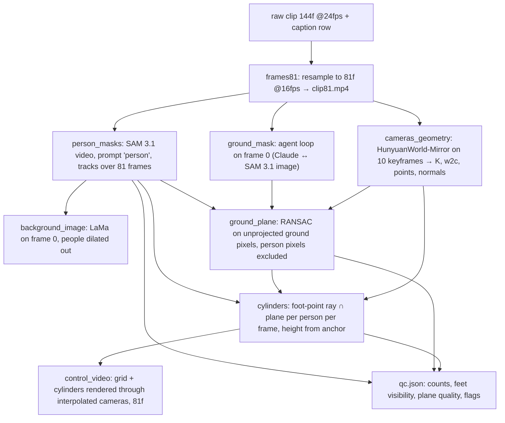

# Preprocessing Design — raw clip → control video (2026-09-09, updated 2026-09-10 for the UW hand-off)

> Review protocol: add comments starting with `>>>>`.
> Section 9 lists the open decisions with options and a recommendation.
> Gate 2 = run this on the 10 pilot clips and read the QC report before touching the other 1990.

## 0. What this stage does, in one paragraph

Input: one raw clip (1280×720, 24 fps, 144 frames) plus its caption row (person count, ground material, flags).
Output, per clip: the 81-frame 16 fps target clip the model will learn to generate; a control video of the same length showing only a ground-plane grid and one cylinder per main subject; a background image with the people removed; and a QC record that says whether the clip is usable for training.
Everything runs per clip, is resumable, and writes into one folder per clip.

## 1. Where it runs and where data lives

Division of work (decided 2026-09-10): Mengyi runs the GPU stages on a UW machine — person tracking, background image, ground-mask agent loop, HunyuanWorld-Mirror — and exports per clip the tracks, the ground points with normals (≤ 50k, world coordinates) and the 10 keyframe cameras; George runs the geometry locally — plane fit, camera interpolation, cylinders, rendering, QC — where iteration is seconds per clip.
The hand-off package is `handoff_mengyi/`.

Gate 2 and the full run happen on a UW GPU machine (Mengyi); any GPU with ≥ 16 GB is enough for every stage.
Raw clips are fetched straight from the public fal.media URLs in `manifest.jsonl` (`download_clips.py`); outputs live in `$DATA/preproc/<id>/` on the UW box, and the small per-clip exports (about 3–4 MB each) come back to George by zip or rsync.
Secrets: the Hugging Face token for `facebook/sam3.1` is provided in the hand-off (`hf_token.txt`, UW box only); the Claude credentials for the ground-mask agent are Mengyi's own (API key or Claude Code subscription).
Models: SAM 3.1 (`facebook/sam3.1`, 3.5 GB, official repo, Python ≥ 3.12, CUDA ≥ 12.6), HunyuanWorld-Mirror (`tencent/HunyuanWorld-Mirror`, cameras + points + normals from the 10 keyframes; replaced Depth Anything 3 after the pilot), LaMa via `simple-lama-inpainting`, and Claude Opus 5 through the API for the agent loop.

## 2. Frame policy

The model trains on 81 frames at 16 fps (5.06 s), so every clip is resampled from 24 fps to 16 fps by dropping every third source frame — `KEEP = [i for i in range(144) if i % 3 != 2][:81]` — which keeps 96 frames and uses the first 81.
Keeping the first 81 preserves the anchor second at the start of the clip.
Mengyi's stages deliver per kept frame (81 frames, as in the pilot) or per source frame; George's side uses exactly these 81 frames, re-encoded as `clip81.mp4`, the training target.
3D reconstruction runs on 10 keyframes evenly spaced over the 81 (source frames 0, 13, 27, 40, 54, 67, 81, 94, 108, 120); camera poses for the other frames are interpolated (linear translation, spherical-linear rotation).

## 3. Pipeline

## 4. Stages in detail

frames81 — decode with ffmpeg, pick the 81 indices, write `clip81.mp4` (libx264, 16 fps) and keep the frames in memory for the rest of the stage.

person_masks — SAM 3.1 video predictor: `start_session` on the 81 frames, `add_prompt(frame_index=0, text="person")`, propagate; output is one mask per tracked object per frame plus boxes and scores.
Main-subject selection: a track counts as a main subject if its mask height is at least 10% of the frame height in the first second and its foot point lands on the fitted ground plane (checked after ground_plane); everything else (stands, far background) is ignored for cylinders but still masked out of the ground fit.
The number of main subjects is compared with the caption's person count and recorded.

background_image — frame 0, union of all person masks dilated by 20 px to cover contact shadows, LaMa inpaint; output `background.png` at 1280×720.
This is the reference image the model is conditioned on.

ground_mask (agentic) — frame 0 only.
Loop up to 3 times: Claude sees the frame and the caption's ground material and proposes one short SAM 3 noun phrase for the walkable flat ground (e.g. "concrete floor", "wet cobblestones"); SAM 3.1 image API returns masks; masks above a score threshold are unioned and person pixels removed; Claude sees the overlay and answers accept / too little / too much / wrong surface, with a revised phrase when rejecting.
Output `ground_mask.png`, the accepted phrase and the judge notes.
If all three attempts are rejected the clip is flagged `ground_fail` and falls back to a plane fit on all non-person pixels in the lower half of the frame, marked as fallback.

cameras_geometry — HunyuanWorld-Mirror on the 10 keyframes without priors: returns per-keyframe camera-to-world poses (OpenCV), intrinsics at its 518 px working resolution, world-coordinate point maps with confidence, depth, and surface normals; the resize factor to 1280×720 is stored so pixels can be mapped both ways.
Geometry is in the reconstruction's own arbitrary scale; nothing downstream needs metric units because the control video is rendered through these same cameras.

ground_plane — take the WorldMirror world points at pixels inside the ground mask (frame-0 mask reused as a prior for keyframes 1–9, with the model's own confidence) and outside all person masks; RANSAC plane fit with an inlier threshold of 1% of the median scene depth, refined by least squares on inliers, with the median ground normal as a consistency check on the fitted normal.
Sanity checks: inlier ratio ≥ 30%; the camera sits above the plane; the plane normal is within 45° of the camera's up axis on frame 0.
Failing checks flags `plane_fail`.
The plane gets an in-plane coordinate frame (origin under the camera at frame 0, u along the projected camera forward direction, v = n × u) that the grid is drawn on.

cylinders — for each main subject and each of the 81 frames: foot pixel = mean x of the lowest 2% of mask rows, y = mask bottom; cast the ray through that pixel with the interpolated camera; intersect with the plane → 3D foot position.
Height: during the anchor second, height in scene units = pixel height of the mask × depth-at-foot / focal length; take the median over those frames and hold it constant for the whole clip (people do not change height).
Radius = 0.2 × height.
If the mask touches the bottom frame edge (feet cut off), the foot position is instead solved from the head pixel and the known height; such frames are counted in QC.
Positions are smoothed along time with a Gaussian of 2 frames; jumps larger than one height per frame are flagged `track_jump`.

control_video — 81 frames at 1280×720 rendered with the interpolated cameras on a black background: the ground plane as a wireframe grid clipped to the padded convex hull of the ground pixels, and one solid cylinder per main subject, drawn back-to-front, each subject in a fixed distinct color; 2× supersampling for clean lines.
Exact look is Decision V.
Encoded as `control.mp4`, 16 fps, same length as `clip81.mp4`.

qc.json — person count found vs expected, number of main subjects, fraction of anchor frames with feet visible per subject, ground phrase and attempts, plane inlier ratio and normal angle, WorldMirror mean confidence, flags, timings.
A clip is training-ready when it has no hard flag (`ground_fail`, `plane_fail`, `count_mismatch`, `no_anchor`); soft flags (`feet_cut_later`, `track_jump`, `low_conf`) are kept for a later decision.

## 5. Outputs per clip

`preproc/<id>/clip81.mp4`, `control.mp4`, `background.png`, `ground_mask.png`, `masks.npz` (81 × H × W bit-packed, per track), `tracks.json` (boxes, scores, main-subject flags), `cams10.npz` (K, w2c, resize factor) and `ground_points.npz` (points, normals, conf), `plane.json`, `cylinders.json` (per frame per subject: x, y, z, height, radius, feet_visible), `qc.json`.
Roughly 30–60 MB per clip; 2000 clips ≈ 60–120 GB, most of it `masks.npz` — masks can be dropped after the control video is verified (Decision K).

## 6. Compute and cost

Per clip: SAM 3.1 video on the frames ≈ 15–30 s, the ground loop ≈ 10–20 s including API latency, LaMa ≈ 1 s, WorldMirror on 10 frames ≈ 1–5 s, plane + cylinders + render ≈ 5 s; call it about 1 minute.
Pilot of 10 clips ≈ 15 minutes including model downloads (SAM 3.1 is 3.5 GB).
Full run: ≈ 33 GPU-hours on a T4 (free tier will disconnect several times; the stage is resumable) or ≈ 8 hours on an A100 (Colab Pro ≈ 100 compute units, or RunPod ≈ $10).
Claude API for the ground loop: about 2000 clips × 3 calls × ~2k tokens with an image ≈ 12M input tokens ≈ $60 on Opus 5, $25 on Sonnet 5.

## 7. Acceptance for Gate 2 (the 10 pilot clips)

All 10 produce every output file without a crash.
At least 8 of 10 are training-ready (no hard flag).
Visual check by George of the 10 control videos side by side with `clip81.mp4`: cylinders stand where the people stand, the grid lies on the real ground, camera motion matches.
The measured per-clip time decides Decision R.

## 8. What is deliberately not done here

Depth Anything 3 was dropped after the pilot: its BASE-model planes came out tilted toward the camera on several clips (vanishing line far below the true horizon, camera height only 0.2–0.5 person heights). HunyuanWorld-Mirror — the model George used originally, with surface normals — replaces it; its license restricts using outputs to improve other models, a risk George accepted on 2026-09-11 in the same class as the Veo terms.
No metric depth alignment; the scene scale is arbitrary and consistent within a clip, which is all the renderer needs.
No temporal ground-mask tracking; the ground is fitted once as a plane, which is the whole point of the control signal.

## 9. Decisions

Decision C — cylinder placement and size.
Option C1: foot-point ray intersected with the fitted plane; height from anchor frames via pixel height × depth / focal; radius 0.2 × height; head-point fallback when feet are cut off.
Option C2: centroid of the person's reconstructed points per keyframe, interpolated between keyframes; simpler but only 10 keyframes have geometry and moving people are exactly where it is least reliable.
Recommendation: C1.

Decision V — control video look.
Option V1: black background, white 2 px grid on the ground plane with spacing equal to the median subject height, solid cylinders each in a fixed distinct color from a 6-color palette (subject order by first-frame x position), painter's-algorithm depth ordering.
Option V2: everything as white wireframe (grid + wire cylinders), no color; simplest signal, but cylinders overlapping in the image become ambiguous.
Option V3: grid plus filled ground mask region and shaded cylinders with a simple directional light; more visual cues, more implementation.
Recommendation: V1.

Decision G — ground-mask agent model.
Option G1: Claude Opus 5 for both the proposal and the judge (≈ $60 for the full run).
Option G2: Sonnet 5 for both (≈ $25).
Recommendation: G1; the judge is a vision call where quality matters and the total is small.

Decision D — geometry model.
Resolved 2026-09-11: HunyuanWorld-Mirror (George's original choice; DA3-BASE was tried on the pilot and its planes came out tilted). License restriction on using its outputs to improve other models is known and accepted by George.

Decision K — keep the per-frame masks after the control video is verified.
Option K1: drop `masks.npz` after QC (saves ~80% of the output volume).
Option K2: keep everything.
Recommendation: K1 for the full run, K2 for the pilot.

Decision R — where the full 1990-clip run happens.
Option R1: Colab Pro A100 (≈ $10/month, ~8 hours, outputs on Drive, then upload to the training box).
Option R2: RunPod A100 (≈ $10, outputs land on the network volume the training will use).
Recommendation: decide after the pilot timing; R2 if the pilot per-clip time exceeds 1 minute on a T4.

Decision P — hard-flag policy for the full run.
Option P1: drop flagged clips (expect 10–20% loss, still 1600+ training clips).
Option P2: regenerate the video for flagged clips with a new seed (about $0.60 each) and re-run preprocessing.
Recommendation: P1 first; P2 only if the loss exceeds 25%.
