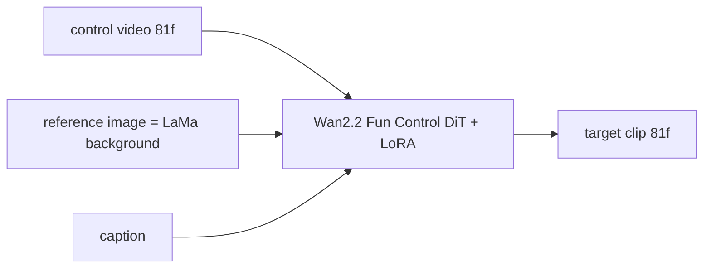

# Training design — Wan2.2-Fun-A14B-Control LoRA on plane-and-cylinder control videos

Status 2026-09-12: data staged, code patched and scripts written; nothing has been run on a GPU yet.
Every number marked TBD is measured at Gate 3 and written back here.

## 0. What we train

The base model is `alibaba-pai/Wan2.2-Fun-A14B-Control` (Apache-2.0, 69 GB on Hugging Face): a two-expert Wan2.2 DiT (low-noise and high-noise) with a control branch and a reference-image path.
We train LoRA adapters (rank 64, alpha 32, on q, k, v, ffn.0, ffn.2) with VideoX-Fun `scripts/wan2.2_fun/train_control_lora.py` in `train_mode=control_ref`.
The control input is our rendered control video (grid + cylinders, 81 frames at 16 fps), the reference image is the LaMa person-free background, the text is the caption, the target is the 81-frame clip.
The two experts are trained one at a time with `--boundary_type low` and then `--boundary_type high`; only the trained expert is loaded during training, so memory is one 14B expert plus activations.

## 1. Data package

`runtime/wan_control_demo/train_data/` is the VideoX-Fun layout: `videos/<id>.mp4`, `control/<id>.mp4`, `ref/<id>.png`, `metadata.json`.
It holds 1935 training clips plus 40 hold-out clips (ids ending in 49 or 99, listed in `holdout.json`, never in any metadata file); total 9.2 GB (hard links to clip81, preproc_full_v2 and mengyi_full).
Each metadata row carries `file_path`, `control_file_path`, `text`, `type: video`, `width: 1280`, `height: 720` as VideoX-Fun expects, plus our extra `ref_file_path`.
Policy decision baked into the manifest (2026-09-12, mine, George to confirm): `count_mismatch` is a soft flag, because after the relaxed anchor rule the remaining mismatches are Veo drawing a different number of people than the caption or bystanders receiving cylinders, and in both cases the cylinders still match what is visible.
A second file `metadata_no_bystanders.json` (1797 rows) drops clips where step 4 found at least five more subjects than the caption asked for; use it if the first training run over-produces crowds.
Camera motion: 47 percent of the training clips have a static camera by measurement (`camera_motion.json`), because Veo ignored most lateral and orbit instructions; George decided on 2026-09-12 not to up-weight moving clips, so training uses `metadata.json` as is and `metadata_balanced_camera.json` stays unused.
Hard flags that still exclude a clip: `ground_fail` (14), `plane_fail` (7), `no_anchor` (5).

## 2. The patch: external reference image

Upstream `control_ref` takes the reference image from a frame of the training clip itself (`--control_ref_image first_frame|random`), which would show the people and leak the layout.
Our patch (`train/patched/`, applied by `apply_patch.sh`, pinned to VideoX-Fun commit 968f0e2 of 2026-09-04) makes the dataset load `ref_file_path` when present and hands it to the collate function at the raw frame size.
The collate function applies the same resize and center-crop as the frames, sets `clip_idx = -1` so the first-frame conv-in channel is zeroed and the full-reference self-attention path carries the image, and uses the same image for the CLIP branch.
That is exactly the path `predict_v2v_control_ref.py` uses at inference when `ref_image` is given without a start image, so training and inference agree.
Rows without `ref_file_path` fall back to upstream behaviour, so the patch is backwards compatible.
Caption dropout (10 percent), the 10 percent random zeroing of the reference, and the random inpaint masks of `--add_inpaint_info` are left as upstream.

## 3. Resolution and schedule

Gate 3 (smoke, 1 GPU): `token_sample_size 640` (the 480p bucket), batch 1, 300 steps, low-noise expert only, checkpoints every 100 steps; expected to fit one 80 GB GPU with `--low_vram` and gradient checkpointing (community consensus, TBD measured).
Gate 4 (full, 8 GPUs, DeepSpeed Zero-2): the same 640 budget for 3 epochs on 1935 clips for each expert, then decide on a 960 (720p) pass once the 640 result is judged.
Step time is TBD; the earlier estimate for 720p was 20 to 30 s per step per H100, so 480p should be well under 10 s.
Inference: `infer.sh` renders 81 frames at 480x832 by default (`SAMPLE_SIZE=720,1280` for full resolution), LoRA weight 0.55 on each expert as upstream recommends.

## 4. Platform

Option A, RunPod Secure Cloud: H100 SXM 80 GB at about 2.99 to 3.29 dollars per GPU-hour on demand, 8-GPU pods available in some regions, per-second billing, a network volume keeps the 69 GB weights and the 9 GB data between pods (0.07 dollars per GB-month, region-locked).
Option B, Lambda: 8 x H100 SXM at 3.99 dollars per GPU-hour since June 2026, reliable machines and fast disks, but single H100s and 8-GPU nodes are often out of stock and there is no persistent volume across instances by default.
Option C, Vast.ai: verified-host H100 at roughly 1.5 to 1.9 dollars per GPU-hour, cheapest by far, but marketplace hosts vary in disk speed and can be interrupted, and 8-GPU boxes with NVLink are rarer.
Option D, Modal: about 3.95 dollars per H100-hour serverless, good for inference bursts, awkward for a multi-hour DeepSpeed job.
Recommendation: RunPod for both gates, because one network volume serves the 1-GPU smoke test and the 8-GPU run without moving 78 GB twice, and its H100 stock has been the most dependable; Vast.ai is the fallback if RunPod has no 8 x H100 in the volume's region, in which case we accept re-downloading the weights.
George's earlier note "A100 should be good enough for LoRA" holds for Gate 3 (A100 80 GB at about 1.2 to 1.4 dollars per hour is fine, just 2 to 3 times slower); for Gate 4 the H100 price per step is lower.

## 5. Budget

Gate 3: 1 x H100 for about 2 hours including setup and one inference sample, about 10 dollars, plus a 100 GB network volume at about 7 dollars per month.
Gate 4 at 640 tokens: two experts x 3 epochs x 1935 clips at an assumed 6 s per step per GPU on 8 GPUs is about 2.5 hours, about 70 dollars; at 960 tokens roughly three times that.
Total for a first trained model is under 150 dollars; the earlier plan reserved 400 to 600 dollars, so one 720p pass and one retrain fit inside the reserve.
Rule from PLAN.md still applies: Gate 3 must pass before the 8-GPU pod is started.

## 6. Data transfer

The Mac's free disk is 13 GB and the external drive writes at 2 MB per second, so the 69 GB weights are downloaded on the pod only, never locally.
The 9.2 GB training set leaves the Mac once: either `upload_data_hf.sh` to a private Hugging Face dataset repo under George's account and then `hf download` on every pod, or `pack_train_data.sh` and `scp` / `runpodctl send` straight to the pod.
The Hugging Face route is recommended because the second and later pods pull at datacenter speed and the repo stays private; it needs George's go-ahead since it publishes the data to his account.

## 7. Steps in order

1. George picks the platform and the data route (Section 4 and 6) and confirms the `count_mismatch` policy (Section 1).
2. Pack or upload the data; create the RunPod network volume; start a 1 x H100 pod with the volume; run `setup_pod.sh`.
3. Run `train_gate3.sh`; watch the loss over 300 steps; run `infer.sh` with a training control video and a hold-out control video; record step time and VRAM here.
4. If Gate 3 passes, start the 8 x H100 pod on the same volume and run `train_full.sh both` at 640 tokens.
5. Evaluate on the 40 hold-out clips and on hand-drawn control videos; then decide on the 960-token pass.

## 8. Reproducibility (George's requirement 2026-09-12)

The trained LoRA weights are not enough; the environment and the exact commands that produced them are part of the deliverable.
After every successful run, `snapshot_env.sh` on the pod writes `pip freeze`, torch and CUDA versions, driver and GPU model, the RunPod image id, the VideoX-Fun commit plus our diff, the config files, the environment variables, and copies of the scripts as run.
`fetch_from_pod.sh` pulls that snapshot together with LoRA checkpoints, logs and samples to `runtime/wan_control_demo/cloud/` and mirrors them to the external drive.
The snapshot is committed next to `train/` so that a new pod can be rebuilt with `setup_pod.sh` pinned to the same versions, and `RUNLOG.md` in `train/` records date, pod type, command, step time, VRAM and result for each run.

## 9. Risks

The reference path with `clip_idx = -1` has not been exercised upstream with an image that is not a frame of the clip; if Gate 3 samples ignore the background, the fallback is `--control_ref_image first_frame` semantics with the background pasted as frame 0 of the target, which we can test in the same pod.
Bucket training resizes 1280x720 to the 640 budget with random aspect adaptation; the control video and the reference go through the identical transform, so alignment is preserved by construction.
`--add_inpaint_info` masks random regions of the target as an extra condition; it is upstream's default for Fun-Control and is kept, but it can be dropped if samples show ghosting.
The DeepSpeed Zero-2 config and `accelerate` versions on the pod image may differ from upstream's; the README pins `deepspeed==0.17.0` and `numpy==1.26.4`, which `setup_pod.sh` installs.
